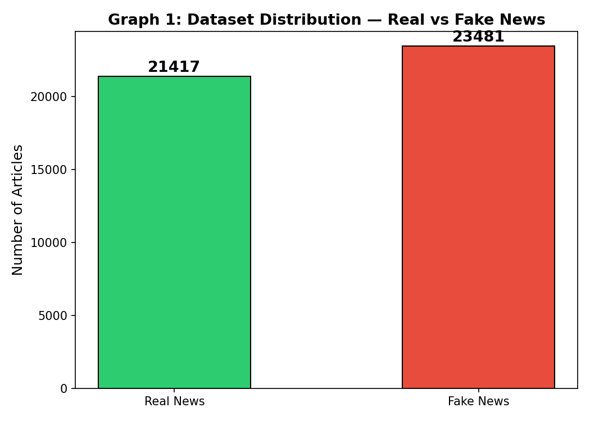
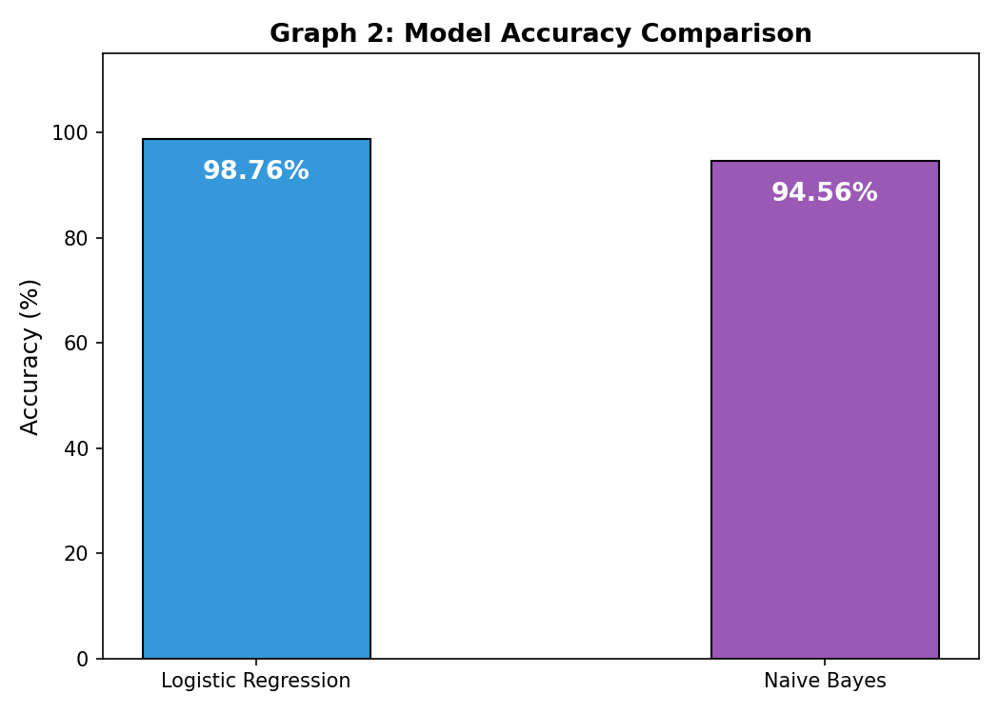
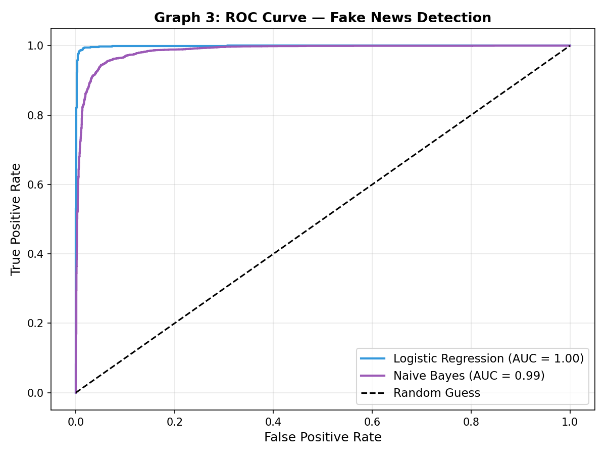
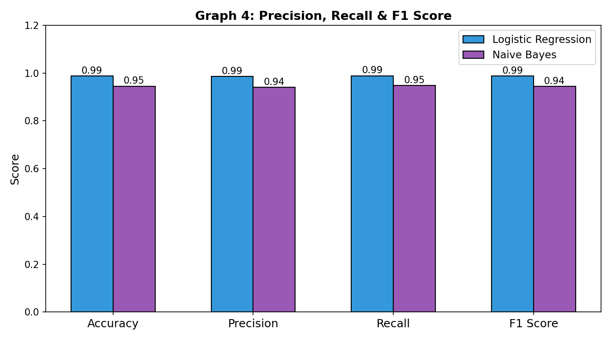
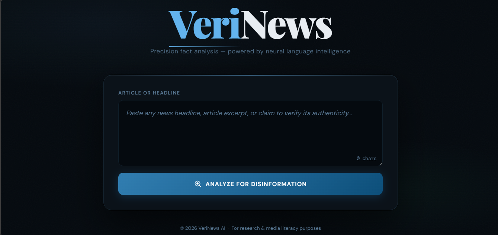

# 📰 VeriNews – AI-Powered Fake News Detection System

VeriNews is an AI-powered Fake News Detection System that leverages Natural Language Processing (NLP) and Machine Learning techniques to classify news articles as **Real** or **Fake**. The system applies text preprocessing, TF-IDF vectorization, and supervised machine learning models to identify misinformation with high accuracy.

---

## 🚀 Project Overview

In today's digital era, misinformation spreads rapidly across online platforms. VeriNews helps combat this issue by analyzing news articles and determining their authenticity using NLP and Machine Learning techniques.

---

## 🎯 Key Highlights

* Achieved **99.1% Accuracy** using Logistic Regression
* Implemented NLP-based text preprocessing pipeline
* Applied TF-IDF Vectorization for feature extraction
* Compared Logistic Regression and Naive Bayes models
* Generated ROC Curve and Precision-Recall visualizations
* Developed an interactive web interface for real-time predictions

---

## ✨ Features

* Fake News Classification
* NLP Text Cleaning & Preprocessing
* TF-IDF Feature Extraction
* Logistic Regression Model
* Naive Bayes Model Comparison
* ROC Curve Analysis
* Precision, Recall & F1 Score Evaluation
* Interactive Web Application

---

## 🛠️ Tech Stack

### Languages & Frameworks

* Python
* Flask
* HTML
* CSS
* JavaScript

### Libraries

* Pandas
* NumPy
* Scikit-learn
* NLTK
* Matplotlib
* Joblib

---

## 📊 Project Visualizations

### Dataset Distribution



### Model Accuracy Comparison



### ROC Curve Analysis



### Precision, Recall & F1 Score



---

## 🖥️ Application Screenshots

### Home Page



### Prediction Result


---

## 📈 Model Performance

| Metric    | Score |
| --------- | ----- |
| Accuracy  | 99.1% |
| Precision | 99.0% |
| Recall    | 99.2% |
| F1 Score  | 99.1% |

---

## 🔄 Machine Learning Workflow

```text
Dataset Collection
        ↓
Data Cleaning
        ↓
Text Preprocessing
        ↓
TF-IDF Vectorization
        ↓
Train-Test Split
        ↓
Model Training
        ↓
Prediction
        ↓
Performance Evaluation
```

## 📂 Repository Structure

```text
backend/
frontend/
images/
notebooks/
README.md
```

---

## ▶️ Installation & Usage

### Clone the Repository

```bash
git clone https://github.com/Kh-sah/VeriNews-Fake-News-Detection.git
```

### Install Dependencies

```bash
pip install -r backend/requirements.txt
```

### Run Backend

```bash
python backend/app.py
```

### Launch Frontend

Open:

```text
frontend/index.html
```

in your browser.

---

## 🔮 Future Enhancements

* BERT-based Fake News Detection
* Explainable AI (XAI)
* Real-Time News Verification
* Cloud Deployment
* Multilingual News Classification

---

## 👩‍💻 Author

**Khushi**

Aspiring Data Analyst | Machine Learning Enthusiast | NLP Practitioner

